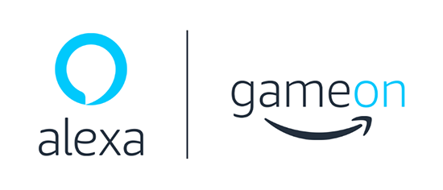
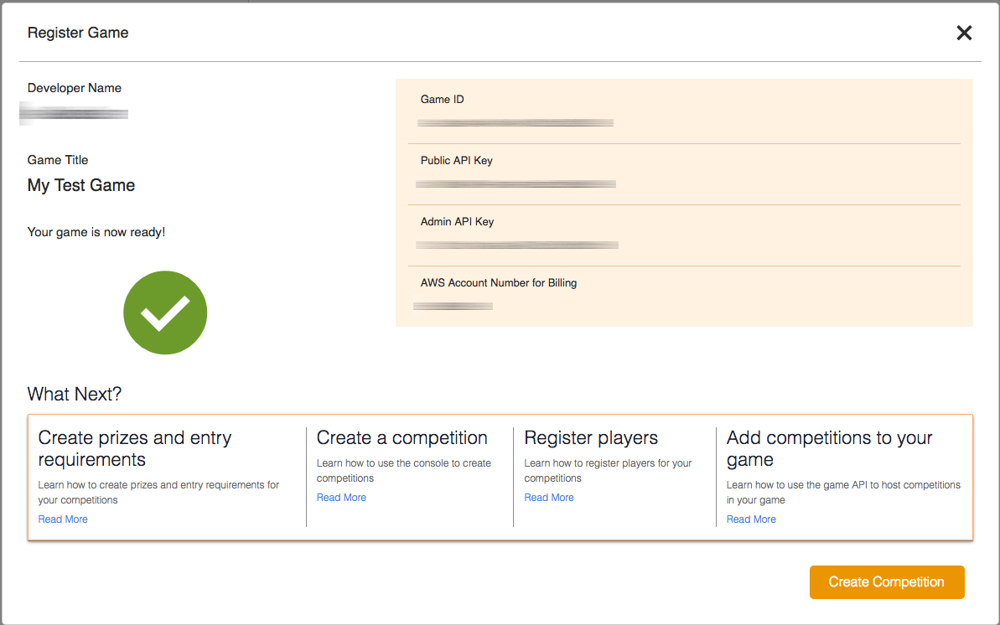
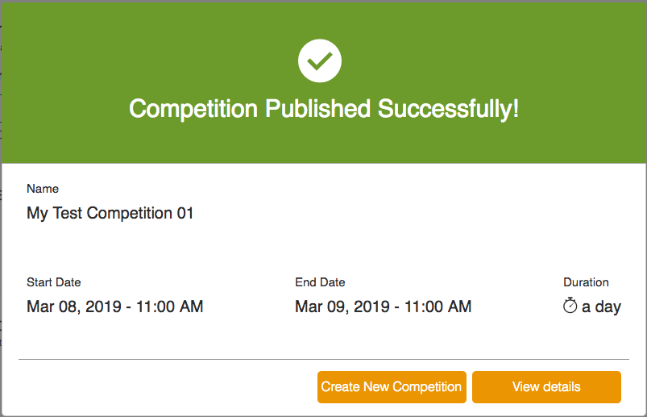
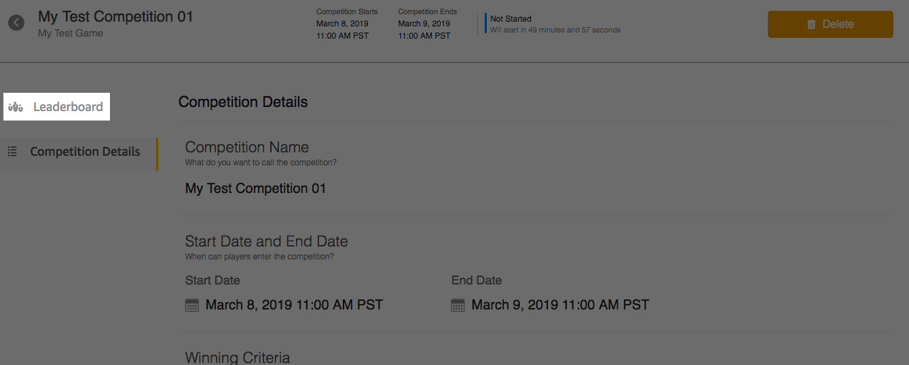
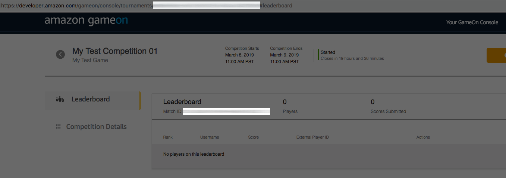
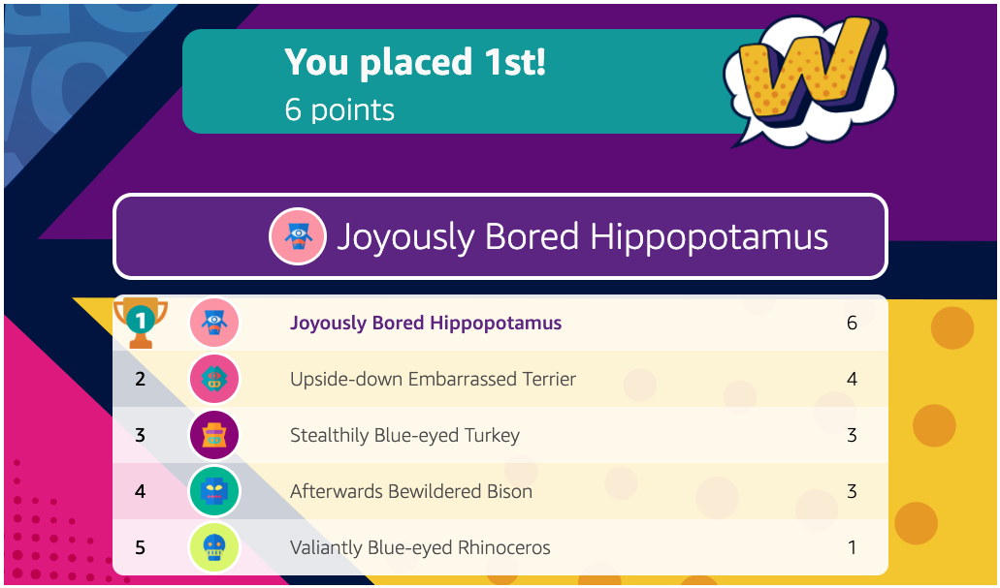

<p align="center">
  
  <br/>
  <h1 align="center">Skills GameOn SDK for Node.js</h1>
  <p align="center"><a href="https://travis-ci.com/alexa-games/skills-gameon-sdk-js/"></a></p>
</p>

> **Note:** This public beta release of the Skills GameOn SDK includes the documentation, SDK code and sample code.
> Please note that we may improve or change the Skills GameOn SDK as we receive feedback and iterate on the feature.

The Skills GameOn SDK for Node.js provides easy access to Amazon GameOn and creates higher-level methods, utilities, and examples that simplify the integration of GameOn features, like leaderboards, with Alexa skills.

## Amazon GameOn

Amazon GameOn is a set of flexible APIs that allow you to build cross-platform competitions into your games that drive engagement and increase monetization. With GameOn, you have an easy tool to strengthen your fanbase with leaderboards and leagues, awarding in-game and real-world prizes fulfilled by Amazon, and enabling streamers to play with their followers with a simple click. To learn more, see <a href="https://developer.amazon.com/gameon" target="_blank">Amazon GameOn</a>.

## License

The Skills GameOn SDK and GameOn SDK packages are licensed under the
[Apache License, Version 2.0](https://www.apache.org/licenses/LICENSE-2.0). The samples are licensed separately under the [Amazon Software License](https://aws.amazon.com/asl/).

## GameOn Pricing

Alexa skill developers who publish an Alexa skill using the Skills GameOn SDK during the beta period will be eligible to receive free plays for usage within the Alexa skill. To qualify for this offer, [click here](https://developer.amazon.com/blogs/alexa/post/671de3de-0635-4626-9371-e926d7d655d6/skills-gameon-sdk) to learn more.

## Packages and Samples

### Packages

* **GameOn SDK** - A dependency free Node.js compatible API client, generated from the GameOn Swagger source with coverage of all the non-Admin API methods.
* **Skills GameOn SDK** - Common features that Alexa skill developers may want to leverage:
  * Player-focused convenience methods:
    * `#initializeNewPlayer`
    * `#refreshPlayerSession`
    * `#enterTournamentForPlayer`
    * `#submitScoreForPlayer`
    * And more!
  * Name generator - for when you want to assign random names to players.
  * Secrets management for deployment on <a href="https://aws.amazon.com/lambda/" target="_blank">AWS Lambda</a>.
  * Avatar generator, for a quick way to pre-create unique avatars for players.
  * APL (Alexa Presentation Language) - example templates and helper methods to get you started with visually displaying a leaderboard.

### Sample Skills

* **Word Word** - A sample skill that showcases daily tournaments and many of the other above features. The Word Word skill is live, so you can enable it on your Alexa devices and play it today. 
More information about the skill is also on the [Alexa Skills Store](https://www.amazon.com/Amazon-Word/dp/B07PQYDDTJ/).

* **Word Word Lite** - A code sample inspired by the live 'Word Word' skill. It leverages the Skills GameOn SDK as in the original skill but has a modified game loop and does not include the production audio assets. The code sample can be found in in the `samples/word-word-lite` directory of this repository.

## Package Versions

| Package       | NPM           |
| ------------- | ------------- |
|[@alexa-games/gameon-sdk](https://github.com/alexa-games/skills-gameon-sdk-js/tree/master/packages/gameon-sdk)| [](https://www.npmjs.com/package/@alexa-games/gameon-sdk) [](https://www.npmjs.com/package/@alexa-games/gameon-sdk)|
|[@alexa-games/skills-gameon-sdk](https://github.com/alexa-games/skills-gameon-sdk-js/tree/master/packages/skills-gameon-sdk)| [](https://www.npmjs.com/package/@alexa-games/skills-gameon-sdk) [](https://www.npmjs.com/package/@alexa-games/skills-gameon-sdk)|

## Contributing

To contribute to the Skills GameOn SDK for Node.js, checkout out the [development](#development)
section below and then the
Skills GameOn SDK for Node.js [contribution guidelines](https://github.com/alexa-games/skills-gameon-sdk-js/blob/master/CONTRIBUTING.md).

## Releases

New Skills GameOn SDK for Node.js versions are released via the GitHub repository
[releases](https://github.com/alexa-games/skills-gameon-sdk-js/releases) page. A
history of changes is recorded in our [changelog](https://github.com/alexa-games/skills-gameon-sdk-js/blob/master/CHANGELOG.md).

## Contact

You can get in touch with the Skills GameOn SDK for Node.js community in the
following ways:

* Email the maintainers listed under the Core section in the [credits page](https://github.com/alexa-games/skills-gameon-sdk-js/blob/master/CREDITS.md).

When communicating within the Skills GameOn SDK community, please mind our
[code of conduct](https://github.com/alexa-games/skills-gameon-sdk-js/blob/master/CODE_OF_CONDUCT.md).

## Getting Started

1. [Prerequisites](#prerequisites)
    1. [Setting up GameOn](#setting-up-gameon)
    1. [Installing the Skills GameOn SDK](#installing-the-skills-gameon-sdk)
1. [Tutorials](#tutorials)
    1. [Implementing a Simple Week-Long Tournament](#simple-week-long-tournament)
    1. [Displaying a Leaderboard with Alexa Presentation Language (APL)](#displaying-a-leaderboard-with-alexa-presentation-language)
    1. [How to Handle Player Names](#how-to-handle-player-names)
1. [Best Practices](#best-practices)
    1. [GameOn API Secret Management](#gameon-api-secret-management)
1. [Samples](#samples)
    1. [Alexa Skill: Word Word](#alexa-skill-word-word)
1. [Development](#development)
    1. [Bootstrapping](#bootstrapping)
    1. [Building](#building)
    1. [Testing](#testing)
    1. [Documenting](#documenting)

## Prerequisites

To get started, you will need to create an AWS account, create an Amazon Developer account, register a game with GameOn, retrieve your Public API key, and install the Skills GameOn SDK.

### Setting up GameOn

#### Create an AWS account

Create your free AWS account <a href="https://portal.aws.amazon.com/gp/aws/developer/registration/index.html" target="_blank">here</a>. If you already have an AWS account, you can skip this step.

#### Retrieve your AWS account ID

Take note of your AWS account ID for use with GameOn. Your account ID will be a 12-digit number. For more information see <a href="https://docs.aws.amazon.com/general/latest/gr/acct-identifiers.html" target="_blank">Finding Your AWS ID</a>.

#### Create an Amazon Developer Console

Create your free Amazon Developer account <a href="https://developer.amazon.com/gameon/console/home" target="_blank">here</a>.
If you already have an Amazon Developer account, you can sign in instead.

#### Register Your Game

To register your game, go to <a href="https://developer.amazon.com/gameon/console/register" target="_blank">GameOn console</a>, click **Get API Keys** or **Register New Game**, and follow the prompts. You will need your AWS account id in this step.

> **NOTE**: Amazon GameOn is a stand-alone service. The **Developer Name** and **Game Title** fields can be arbitrary;
they do not need to match anything related to your AWS or ASK setups.

#### Retrieve Your Public API Key

After registering your game, you will gain access to your respective GameOn Public API Key. Save this string for later use when setting up the Skills GameOn client.



> **NOTE**: If you forget your GameOn Public API Key, you can always retrieve it from the [GameOn Registered Games](https://developer.amazon.com/gameon/console/register) page and by clicking "Details" next
to your game in question.

### Installing the Skills GameOn SDK

To install the Skills GameOn SDK with NPM, use:

```bash
npm install @alexa-games/skills-gameon-sdk
```

## Tutorials

### Simple Week-Long Tournament

In this tutorial, you'll set up a simple, week-long tournament in
the GameOn developer console. Then, you'll learn how to interact with that
tournament using the Skills GameOn SDK so that your players can enter it,
submit scores to it, and get the leaderboard for it. Specifically, you'll
step through how to:

1. Set up a Competition through the GameOn developer console.
1. Use the Skills GameOn SDK to:
    1. Register a New Player with GameOn.
    1. Authenticate the Player.
    1. Enter the Player into the Tournament.
    1. Submit the Player's Score for the Match.
    1. Reenter the Player into the Tournament's Match.
    1. Get the Leaderboard for the Match.

#### Set up a Competition

Go to <a href="https://developer.amazon.com/gameon/console/home" target="_blank">Competition Settings</a>
and select `Create Competition`.

>**NOTE**: For this tutorial, use the following settings:
>
>* **Competition Name**: Any arbitrary name.
>* **Start Date**: Accept the default.
>* **End Date**: Set this to one week from the start date. (For a persistent leaderboard, you can set this to 100 years out.)
>* **All Other Settings**: Accept the defaults.

Once the competition has been created, select "View details".

>**NOTE**: If you receive an error while creating the competition, your developer console session may have timed out. Try refreshing the page and trying again.



Select `Leaderboard`.



Note the `Tournament ID` and the `Match ID`. You will need them so that your players
can enter the tournament, reenter the tournament's match, submit scores to the match,
and to retrieve the match's leaderboard. The `Tournament ID` can be found in the URL.



#### Register and Authenticate a New Player

For each new user of your Alexa skill, you must first register & authenticate
them with the GameOn service before they can enter tournaments, enter matches,
and submit scores.

The typical workflow is:

* Register a new Player with GameOn. A Player can be considered new when:
  * a new user is launching your game for the first time,
  * your game is setting up a local multiplayer tournament, and/or
  * any other scenario where a new player is joining the game.
* Authenticate the Player to obtain a session token for communicating with the GameOn API
whenever (a) the previous session token has expired, or (b) it's a new Player.

```typescript
import { SkillsGameOnApiClient } from '@alexa-games/skills-gameon-sdk';

const client = new SkillsGameOnApiClient();

const player = await client.initializeNewPlayer({
    gameApiKey: '<GAMEON_PUBLIC_API_KEY>', // Your Public API Key you receive when you register your game with GameOn.
    appBuildType: 'development' // GameOn API requires either 'development' or 'release', but it's only used for their metrics.
});
```

The method will return a ```Player``` with structure:

```javascript
{
    "externalPlayerId": "<GAMEON_PLAYER_ID>",
    "playerToken": "<GAMEON_PLAYER_TOKEN>",
    "sessionId": "<GAMEON_PLAYER_SESSION_ID>",
    "sessionApiKey": "<GAMEON_PLAYER_SESSION_API_KEY>",
    "sessionExpirationDate": "<GAMEON_PLAYER_SESSION_EXPIRATION_DATE>"
}
```

> **NOTE**: If you are interested in creating a player with a profile (name, color, and avatar), you can use the `#initializeNewAugmentedPlayer`
> method that is available with the `SkillsGameOnApiClient`. This method is similar to `#initializeNewPlayer` except that it also
> takes in an additional `PlayerProfileGenerator` as a parameter. To instantiate a `PlayerProfileGenerator`, please see the section
> [How to Handle Player Names](#how-to-handle-player-names).
> A success message</p>
>
> **NOTE**: For the rest of this tutorial, when you see `player`, it is referring to the player object
> that we created in this step.
>
> **NOTE**: We also provide a convenience method for refreshing your Player's
> GameOn session. The call will looking something like:

```typescript
await client.refreshPlayerSession({
    gameApiKey: '<GAMEON_PUBLIC_API_KEY>', // Your Public API Key you receive when you register your game with GameOn.
    appBuildType: 'development', // GameOn API requires either 'development' or 'release', but it's only used for their metrics.
    player: player
});
```

#### Enter the Player into the Game's Tournament

A player must first enter the Tournament before they can enter matches
and submit their scores.

```typescript
await client.enterTournamentForPlayer({
    tournamentId: '<GAMEON_TOURNAMENT_ID>', // The Tournament ID that is associated with your game.
    player: player
});
```

#### Enter the Player into the Tournament's Match

Before a player can submit a score to a match, they must first join said
match. To do that, call:

```typescript
await client.enterMatchForPlayer({
    matchId: '<GAMEON_MATCH_ID>', // The Match Id that is associated with your tournament.
    player: player
});
```

#### Submit the Player's Score

Now the player can submit their score to the tournaments's match, like so:

```typescript
await client.submitScoreForPlayer({
    matchId: '<GAMEON_MATCH_ID>',
    submitScoreRequest: { score: 10 },
    player: player
});
```

> **NOTE**: You must **always** enter the match before submitting a score.

#### Get the Leaderboard

To retrieve just the top scorers on the leaderboard, you can call:

```typescript
await client.getMatchLeaderboardForPlayer({
    matchId: '<GAMEON_MATCH_ID>',
    player: player
});
```

The method will return a ```GetMatchLeaderboardResponse``` with structure:

```javascript
{
    leaderboard: [
        {
            externalPlayerId: "<GAMEON_PLAYER_ID_1>",
            playerName: "player278",
            score: 70,
            rank: 1
        },
        {
            externalPlayerId: "<GAMEON_PLAYER_ID_2>",
            playerName: "player5846",
            score: 50,
            rank: 2
        }
    ],
    leaderboardStat: "points",
    next: "/matches/<GAMEON_MATCH_ID>/leaderboard?limit=2&cursor=<CURSOR_ID>"
}
```

To get the player's tournament rank and their neighbors on the leaderboard, call:

```typescript
await client.getMatchLeaderboardForPlayer({
    matchId: '<GAMEON_MATCH_ID>',
    player: player,
    currentPlayerNeighbors: 5 // Note: GameOn will not accept a value <= 0.
});
```

The method will return a ```GetMatchLeaderboardResponse``` with structure:

```javascript
{
    currentPlayer: {
        externalPlayerId: "<CURRENT_PLAYER_ID>",
        playerName: "player5846",
        score: 50,
        rank: 2
    },
    leaderboardStat: "kills",
    neighbors: [
        {
            externalPlayerId: "<GAMEON_PLAYER_ID_1>",
            playerName: "player278",
            score: 70,
            rank": 1
        },
        {
            externalPlayerId: "<CURRENT_PLAYER_ID>",
            playerName: "player5846",
            score: 50,
            isCurrentPlayer: true,
            rank": 2
        },
        {
            externalPlayerId: "<GAMEON_PLAYER_ID_2>",
            playerName: "player1210",
            score: 20,
            rank: 3
        }
    ]
}
```


#### Get the Current Player's Score

To get the current player's score and rank, you can call our convenience method:

```typescript
await client.getPlayerScore('<GAMEON_MATCH_ID>', player);
```

The method will return a ```PlayerScore``` with structure:

```javascript
{
    matchId: "<GAMEON_MATCH_ID>",
    score: 20,
    rank: 1,
    ordinal: "first"
}
```

### Displaying a Leaderboard with Alexa Presentation Language

This is a tutorial section that illustrates how you can render a leaderboard from your skill onto Alexa devices that have screens. 
Note that this is just a tutorial and a bootstrapping procedure, so it is not the absolute way to do this.

Since this method uses the Alexa Presentation Language (APL) to render the leaderboards, 
you must ensure that your skill is configured to support APL by following the instructions [here](https://developer.amazon.com/docs/alexa-presentation-language/apl-support-for-your-skill.html).

The Skills GameOn SDK includes a utility method to render an APL directive that will display your match's leaderboard.
This utility is a great starting point for those who want to enhance their skill with visual elements.

To show the top 5 scores of a match, first call the getMatchLeaderboardForPlayer method in the SkillsGameOnApiClient to get your leaderboard data.
Pass the data into this function to generate APL.

The resulting leaderboardDirective is a well-formed `Alexa.Presentation.APL.RenderDocument` directive that you can send in your skill's response.

```javascript
const client = new SkillsGameOnApiClient();
const leaderboard = client.getCombinationLeaderboards({ player, matchId: '<GAMEON_MATCH_ID>', topScoresLmit, playerNeighborsLimit });
const renderOptions = { backgroundImageUrl: '<IMAGE_URL>' };
const playerProfileGenerator = PlayerProfileGeneratorBuilder.getGenerator({ avatarBaseUrl: '<AVATAR_BASE_URL>' });
const leaderboardDirective = renderLeaderboard(player, leaderboard, renderOptions, playerProfileGenerator); // #renderLeaderboard is part of the @alexa-games/skills-gameon-sdk package.
```

### How to Handle Player Names

#### Optional: Player Profile Generation

The Skills GameOn SDK includes mechanisms to generate a unique name and avatar for your players.  These two values together are referred to as the player profile.

The player name is a string such as "Jim from Seattle" or something random such as "Grumpy Kowolla."  The avatar is a URI that references an image that you previously generated and hosted on S3 or another website.

The simplest way to create a player profile is with an instance of PlayerProfileGenerator which you retrieve from PlayerProfileGeneratorBuilder.  For example:

```javascript
const generator = PlayerProfileGenerator.getGenerator({
    locale: "en-US",
    avatarBaseUrl: "https://s3.amazonaws.com/YOUR_BUCKET_NAME",
    numberOfUniqueAvatars: 50
});
```

Once you have a generator, get a random profile such as:

```javascript
const randomProfile = generator.getRandomPlayerProfile();
```

Or a unique but consistent profile such as:

```javascript
const uniqueProfile = generator.getPlayerProfileFromId(playerId);
```

The generator returns this:

```javascript
{
    name: "Grumpy Kowolla",
    avatar: "https://example.com/myskillarea/avatars/34.png"
}
```

Use these properties with other leaderboard APIs to store the generated name.  Because the avatar URL cannot
be stored with the leaderboard, use
**generator.getPlayerProfileFromId(playerId)**
to get a consistent avatar for that player.

If you don't need both an avatar URL and a name for your skill, you may generate these properties separately using
**PlayerAvatarUriGenerator** and **PlayerNameGenerator** respectively.

Of course, you can create names and avatars using other mechanisms of your choosing.

#### Name Generation

You may use **PlayerNameGenerator** to generate just a name for your player such as:

```javascript
const generator = PlayerNameGeneratorBuilder.getGenerator('en-US');

// Generate consistent name from hash.
const hash = getHash(id);
const name1 = generator.getFromHash(hash);

// Generate consistent name from id.
const name2 = generator.getFromId(id);

// Generate random name.
const name3 = generator.getRandom();
```

The first parameter, *locale*, indicates the preferred language of the word list. Currently only English
words are selected regardless of the provided locale. This gives us the ability to add support for new
languages in the future without changing the API signature.

#### Avatar URI Generation

You may use **PlayerAvatarUriGenerator** to generate just the avatar URI for you player.

```javascript
const generator = PlayerAvatarUriGeneratorBuilder.getGenerator({
                    avatarBaseUrl: "https://example.com/myskillarea/avatars",
                    numberOfUniqueAvatars: 50
                });

// Generate consistent avatar image from hash.
const hash = getHash(id);
const uri1 = generator.getFromHash(hash);

// Generate consistent avatar image from id.
const uri2 = generator.getFromId(id);

// Select a random avatar image.
const uri3 = generator.getRandom();
```

#### Avatar Generation

The SDK includes a CLI tool that demonstrates one way to generate images that you could use as avatars.
You will likely want images unique to your skill and branding, but these images can serve as placeholders
or just as illustration.

```bash
npm install gridy-avatars convert-svg-to-png
npx avatar-maker
```

This will generate 500 avatars in a directory called **avatars**.  Use the --help option for
other options:

```bash
npx avatar-maker -- --help

This CLI tool will generate a 100x100 pixel image that can be used as a player avatar.
By default, the script will create 500 images in the avatars directory.
You may specify different values in the first two parameters of the script. For example:

       npx avatar-maker -- 50 avatar1

Will create 50 images in the avatar1 directory.
```

Here is the output of the script:

```bash
npx avatar-maker

Generating 500 avatars in directory 'avatar'
Creating avatars
Saving file ${CWD}/avatars/0.png from 756603
Saving file ${CWD}/avatars/1.png from 114505
...
Saving file ${CWD}/avatars/498.png from 772043
Saving file ${CWD}/avatars/499.png from 361160
```

## Best Practices

### GameOn API Secret Management

Rather than exposing your GameOn Public API key in cleartext in your source code, we
strongly recommend using a service such as AWS Key Management Service to keep
your key secret & safe.

There are several strategies to do this, but we're only going to highlight two.

> **NOTE**: The following tutorials assume that you're using AWS Lambda to host your skill.

#### Using Environment Variable Encryption

This strategy is much simpler than the next. It's the preferred one
if you don't have any plans to share secrets with other developers, or if
you don't have plans to set up any kind of multi-stage pipeline.

When you create or update Lambda functions that use environment variables,
AWS Lambda encrypts them using the AWS Key Management Service. When your
Lambda function is invoked, those values are decrypted and made available
to the Lambda code.

Check out the AWS documentation on <a href="https://docs.aws.amazon.com/lambda/latest/dg/env_variables.html#env_encrypt" target="_blank">Environment Variable Encryption</a>
for instructions on how to use this strategy.

#### Using an Encrypted Secrets File

This strategy will create an encrypted secrets file.
This can be fully automated (no reason to abbreviate environment variables) and can
be safely checked into source code and shared between developers.

In this section we'll:

1. Create a KMS key with the AWS CLI.
1. Encrypt your GameOn API secret file with the AWS CLI.
1. Upload your encrypted secret file to AWS S3 with the AWS CLI.
1. Decrypt your secret file in your skill at runtime with our tool.

##### 1. Create the AWS KMS Key

The AWS KMS key is necessary to encrypt/decrypt files with the AWS KMS service.

###### Create the AWS KMS Key Policy File

We need to define a KMS Key policy that gives your skill's Lambda function
access to the AWS KMS key to perform the decryption operation at runtime.

Create a file called ```kmsPolicy.json```, and put the following inside:

```json
{
  "Id": "key-policy-gameon",
  "Version": "2012-10-17",
  "Statement": [
    {
      "Sid": "Enable IAM User Permissions",
      "Effect": "Allow",
      "Principal": {
        "AWS": "arn:aws:iam::YOUR_SKILL_AWS_ACCOUNT_ID:root"
      },
      "Action": "kms:*",
      "Resource": "*"
    },
    {
      "Sid": "Allow standard access",
      "Effect": "Allow",
      "Principal": {
        "AWS": "arn:aws:iam::YOUR_SKILL_AWS_ACCOUNT_ID:user/YOUR_SKILL_MANAGEMENT_IAM_USER_NAME"
      },
      "Action": [
        "kms:Encrypt",
        "kms:Decrypt",
        "kms:ReEncrypt*",
        "kms:GenerateDataKey*",
        "kms:DescribeKey"
      ],
      "Resource": "*"
    },
    {
      "Sid": "Allow decrypt-only",
      "Effect": "Allow",
      "Principal": {
        "AWS": "arn:aws:iam::YOUR_SKILL_AWS_ACCOUNT_ID:role/YOUR_SKILL_LAMBDA_FUNC_EXECUTION_ROLE"
      },
      "Action": "kms:Decrypt",
      "Resource": "*"
    }
  ]
}
```

Be sure to replace the following stubs with your values:

* ```YOUR_SKILL_AWS_ACCOUNT_ID```: The AWS Account ID where the skill is
deployed.
* ```YOUR_SKILL_MANAGEMENT_IAM_USER_NAME```: The name of the AWS IAM User
that is deploying the skill's stack.
* ```YOUR_SKILL_LAMBDA_FUNC_EXECUTION_ROLE```: The execution AWS IAM Role
for your skill's Lambda function.

###### Create the AWS KMS Key with the AWS CLI

Run the following AWS CLI commands:

```bash
-> aws kms create-key --policy file://kmsPolicy.json --profile YOUR_SKILL_MANAGEMENT_IAM_USER_NAME --region us-east-1

{
    "KeyMetadata": {
        "AWSAccountId": "YOUR_SKILL_MANAGEMENT_IAM_USER_NAME",
        "KeyId": "YOUR_AWS_KMS_KEY_ID",
        "Arn": "arn:aws:kms:us-east-1:YOUR_SKILL_AWS_ACCOUNT_ID:key/YOUR_AWS_KMS_KEY_ID",
        "CreationDate": 1552500200,
        "Enabled": true,
        "Description": "",
        "KeyUsage": "ENCRYPT_DECRYPT",
        "KeyState": "Enabled",
        "Origin": "AWS_KMS",
        "KeyManager": "CUSTOMER"
    }
}

-> aws kms create-alias --alias-name alias/GameOnApiKey --target-key-id YOUR_AWS_KMS_KEY_ID
```

##### 2. Encrypt your GameOn API Secret

###### Create the Cleartext File

Create the file ```cleartext.json``` that has a JSON structure with your
GameOn Public API Key inside. Like this:

```json
{
    "gameOnApiKey": "YOUR_GAMEON_API_KEY"
}
```

###### Encrypt the Cleartext File with the AWS CLI

```bash
-> aws kms encrypt \
--key-id YOUR_AWS_KMS_KEY_ID \
--plaintext fileb://cleartext.json \
--query CiphertextBlob \
--output text \
--profile YOUR_SKILL_MANAGEMENT_IAM_USER_NAME \
--region us-east-1 \
| base64 --decode > encrypted.txt
```

This will output an ```encrypted.txt``` file.

##### 3. Upload Encrypted GameOn API Secret

Now you'll upload your encrypted secret to AWS S3 so that your skill can
refer to it when using the AWS KMS service at runtime.

###### Create AWS S3 Bucket with the AWS CLI

You'll need an AWS S3 Bucket to hold your encrypted file.

```bash
-> aws s3 create-bucket --bucket YOUR_SKILL_NAME --profile YOUR_SKILL_MANAGEMENT_IAM_USER_NAME --region us-east-1

{
    "Location": "/YOUR_SKILL_NAME"
}
```

###### Upload the Encrypted File to S3 with the AWS CLI

```bash
-> aws s3 cp encrypted.txt s3://YOUR_SKILL_NAME/gameon/secret.txt --profile YOUR_SKILL_MANAGEMENT_IAM_USER_NAME --region us-east-1

upload: ./encrypted.txt to s3://YOUR_SKILL_NAME/gameon/secret.txt
```

> **NOTE**: Your file's URL will be ***https://s3.amazonaws.com/YOUR_SKILL_NAME/gameon/secret.txt***.
> Remember it because you'll need it for the next step.

##### 4. Decrypt your GameOn API Secret

Now, in your skill, it's time to decrypt your GameOn API Secret so that you
can make calls to the GameOn service. We've created a tool for you
to use in your skill's code, and now we'll show you how to use it.

###### Decrypt your GameOn API Secret with our Tool

In your skill's code, you can use our ```KmsDecryptionHelper``` to get your
GameOn Public API Key. Here's an example of its use in TypeScript:

```typescript
import { KmsDecryptionHelper } from '@alexa-games/skills-gameon-sdk';

async function getGameOnApiKey(): Promise<string> {
    const secretFileUrl = 'https://s3.amazonaws.com/YOUR_SKILL_NAME/gameon/secret.txt';
    const kmsKeyRegion = 'us-east-1';

    const secrets = await KmsDecryptionHelper.getSecrets(secretFileUrl, kmsKeyRegion);

    return secrets['gameOnApiKey'];
}
```

And that's it. You are now safely managing your GameOn Public API Key.

## Samples

### Alexa Skill: Word Word

Word Word is a fun tongue-twisting challenge. When playing, Alexa will give you a silly, random word. Simply repeat the 
word as many times as you can as fast as you can. Then see how you rank against the daily leaderboard! The Word Word 
skill is live, so you can enable it on your Alexa devices and play it today. More information about the skill is also 
on the [Alexa Skills Store](https://www.amazon.com/Amazon-Word/dp/B07PQYDDTJ/).

### Code Sample: Word Word Lite

Word Word Lite is a bare-bones sample skill inspired by the official 'Word Word' game. The code sample can be found in in the `samples` directory.
To deploy this sample in your Alexa developer account, you will need to complete following steps:

1. Use the ASK CLI to set up a new skill project . Check out the [ASK CLI](https://developer.amazon.com/docs/smapi/quick-start-alexa-skills-kit-command-line-interface.html) for instructions on how to setup a new custom skill project.
1. Copy the files under the src folder to the `lambda/custom/` folder in your new custom skill project.
1. Copy the `skill.json` and the models folder to your custom skill.
1. Set up environment variables for the variables defined in the  `src/settings.js` file. Refer to the section [Using Environment Variable Encryption](#using-environment-variable-encryption) for instructions on how to set up environment variables for your Lambda function.
1. Build the skill and deploy using the ASK CLI.

#### Skill Flow

1. Launch

   Skill will launch and check if the player has been created. If the player has not been created it will register a new player with GameOn.
   Otherwise, the skill will check if it needs to refresh the player's session with the GameOn services.
1. Challenge
   Immediately after launch, the game will move to the challenge state where it gets the challenge word and gives the player
   instructions. The user utterance is mapped to the PLAY_GAME_INTENT which has 52 slot values. An example of this model
   can be found at `samples/word-word-lite/models/en-US.json`.
1. Result

   The score is calculated by the skill code and submitted to GameOn. 
   Updated leaderboards are requested from GameOn, parsed and returned to the user.

#### Leaderboards

Here some screenshots of Word Word's leaderboard. It uses the Alexa Presentation
Language (APL) for rendering, and GameOn for the player data.



## Development

### Lerna

This repository uses Lerna, a tool for managing projects with multiple packages.

Link: https://lernajs.io/

### Bootstrapping

Clone the repository and run ```npm install```. This will install dependencies and bootstrap the Lerna project.

### Building

To build every package in this project, go to the root of the repository and run ```npm run build```.

### Testing

To test every package in this project, go to the root of the repository and run ```npm run test```.

### Documenting

The documentation is generated from doc comments with [TypeDoc](https://typedoc.org/). Comments support Markdown format, which means full examples and links can be included.

#### Generating the Docs

From the root of the project, run ```npm run document```
